<a name="HOLTop" ></a>
# Deployment and Azure #

---

<a name="Overview" ></a>
## Overview ##

Microsoft Azure offers secure and flexible development, deployment and scaling options for any size web application. Leverage your existing tools to create and deploy applications without the hassle of managing infrastructure.

Provision a production web application on your own in minutes by easily deploying content created using your favorite development tool. You can deploy an existing site directly from source control with support for **Git**, **GitHub**, **Bitbucket**, **CodePlex**, **TFS**, and even **Dropbox**. Deploy directly from your favorite IDE or from scripts using **PowerShell** in Windows or **CLI** tools running on any OS. Once deployed, keep your sites constantly up-to-date with support for continuous deployment.

Microsoft Azure provides scalable, durable cloud storage, backup, and recovery solutions for any data, big or small. When deploying applications to a production environment, storage services such as Tables, Blobs and SQL Databases help you scale your application in the cloud.

This module will show you the different topics you could encounter when deploying your site to production environments in Microsoft Azure.

<a name="Objectives" ></a>
### Objectives ###
In this module, you'll see how to:

- Create and deploy a Web Application to a Microsoft Azure Web App using Visual Studio
- Change behavior of your app based on different deployment environments
- Work with Multiple Deployments Slots in Azure

<a name="Prerequisites"></a>
### Prerequisites ###

The following is required to complete this module:

- [Visual Studio Community 2015][1] or greater
- [ASP.NET Core 1.0][2]

[1]: https://www.visualstudio.com/products/visual-studio-community-vs
[2]: https://get.asp.net

> **Note:** You can take advantage of the [Visual Studio Dev Essentials]( https://www.visualstudio.com/en-us/products/visual-studio-dev-essentials-vs.aspx) subscription in order to get everything you need to build and deploy your app on any platform.

<a name="Setup" ></a>
### Setup ###
In order to run the exercises in this module, you'll need to set up your environment first.

1. Open Windows Explorer and browse to the module's **Source** folder.
1. Right-click **Setup.cmd** and select **Run as administrator** to launch the setup process that will configure your environment and install the Visual Studio code snippets for this module.
1. If the User Account Control dialog box is shown, confirm the action to proceed.

> **Note:** Make sure you've checked all the dependencies for this module before running the setup.

<a name="Exercises" ></a>
## Exercises ##
This module includes the following exercises:

1. [Build and Deploy from Visual Studio](#Exercise1)
1. [Working with Environments in Visual Studio](#Exercise2)
1. [Working with Multiple Deployment Slots](#Exercise3)


Estimated time to complete this module: **60 minutes**

>**Note:** When you first start Visual Studio, you must select one of the predefined settings collections. Each predefined collection is designed to match a particular development style and determines window layouts, editor behavior, IntelliSense code snippets, and dialog box options. The procedures in this module describe the actions necessary to accomplish a given task in Visual Studio when using the **General Development Settings** collection. If you choose a different settings collection for your development environment, there may be differences in the steps that you should take into account.

<a name="Exercise1"></a>
### Exercise 1: Build and Deploy from Visual Studio ###

**Azure App Service Web Apps** is a fully managed platform that enables you to build, deploy and scale enterprise-grade web apps in seconds. Focus on your application code, and let Azure take care of the infrastructure to scale and securely run it for you.

In this exercise you'll create a new Web site in Visual Studio based on the **ASP.NET Core 1.0 Web Application** project template and then publish the application to an **Azure App Service Web App**.

<a name="Ex1Task1"></a>
#### Task 1 - Deploying a ASP.NET Core application to Azure ####

1. Open **Visual Studio Community 2015** and select **File | New | Project...** to create a new solution.

1. In the **New Project** dialog box, select **ASP.NET Web Application** under the **Visual C# | Web** tab, and make sure **.NET Framework 4.6** is selected. Name the project _MyWebApp_, choose a **Location** and click **OK**.

    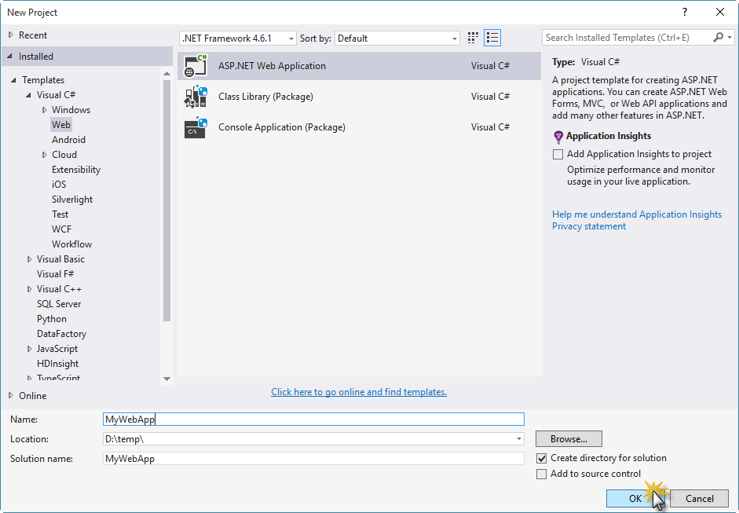

    _New ASP.NET Web Application project_

1. In the **New ASP.NET Project** dialog box, select the **Web Application** template under **ASP.NET 5 Templates**. Also, make sure that the **Authentication** option is set to **No Authentication**. Make sure the "**Host in the cloud**" option is not checked (you will run this manually). Click **OK** to continue.

    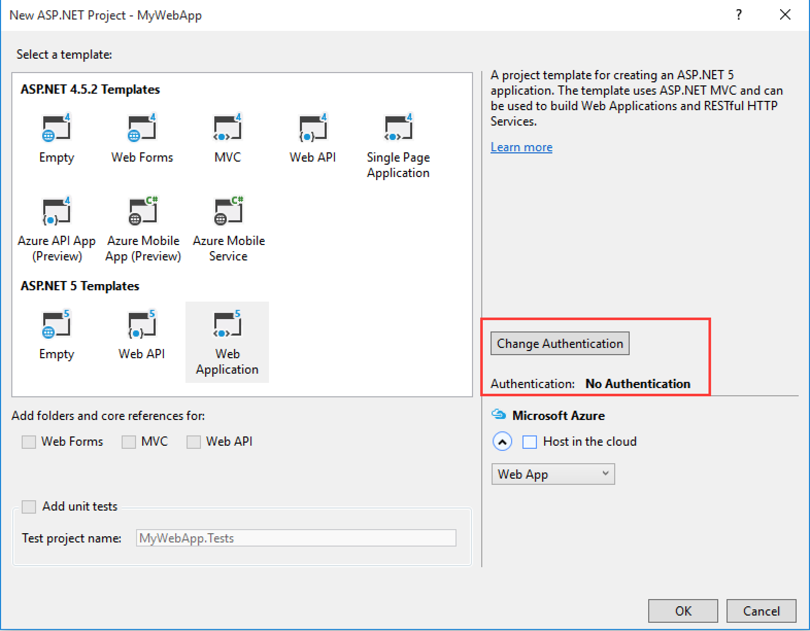

    _Creating a new project with the Web Application template_

1. Right-click the **MyWebApp** project and select **Publish...**. In the **Publish Web** dialog, click **Microsoft Azure App Service**.

    

    _Microsoft Azure App Service_

1. Click **Add an account...**. to sign in to Visual Studio with your Azure account.

    

    _Adding an account_

1. Then, click **New...** to open the _Create App Service_ dialog box. The _Create App Service_ dialog box will appear. Fill the **Web App Name** and **Resource Group** fields. Then click the **New...** button next to **App Service Plan**.

    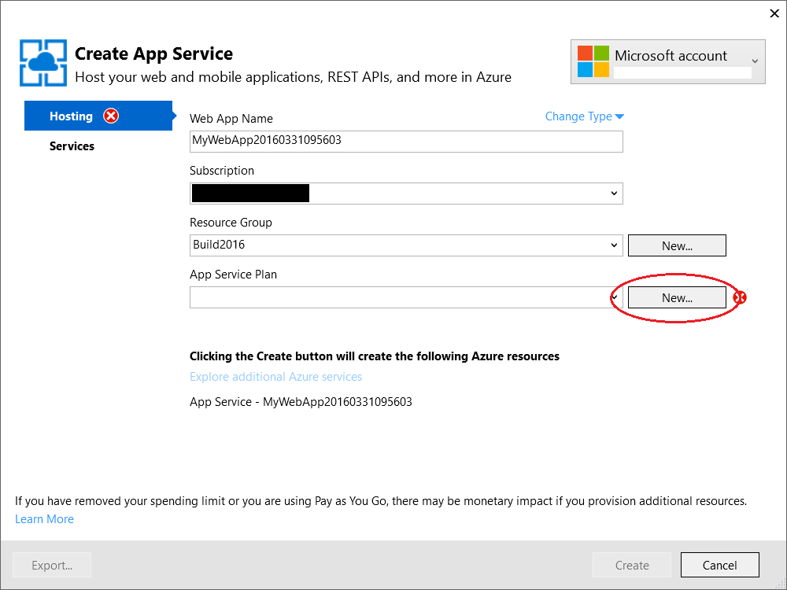

    _Create App Service dialog box_

1. Click **OK** in the Configure App Service Plan dialog.

    

    _Configure the App Service Plan_

1. Click the **Create** button in the Create App Service Plan and wait while Azure provisions your resources.

1. Back in the **Publish Web** dialog, all the connection fields should be populated. Click **Next >**. In the settings tab, expand the **Target DNX Version** box to see the different possibilities and click **Publish** to publish the site.

    

    _Publishing the site to the new Microsoft Azure Web App_

    Once publishing completes, the web app will be automatically launched in your browser (at **http://{yourwebappname}.azurewebsites.net**).

    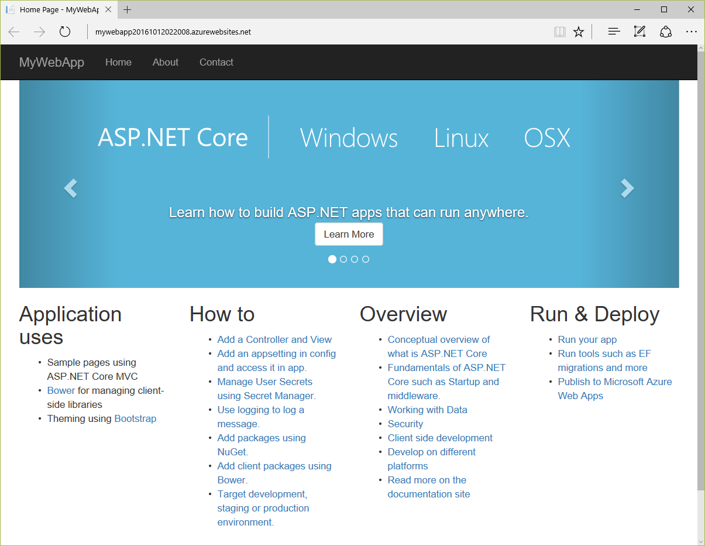

    _Web app published to Azure_

<a name="Exercise2"></a>
### Exercise 2: Working with Environments in Visual Studio ###

ASP.NET Core introduces improved support for controlling application behavior across multiple environments, such as development, staging, and production. Environment variables are used to indicate which environment the application is running in, allowing the app to be configured appropriately.

In this exercise, you'll add code to this application to change its behavior based on the active environment. You will use Visual Studio launch profiles to test different environments locally.

ASP.NET Core uses a particular environment variable, ASPNET_ENV (or Hosting:Environment), to describe the environment the application is currently running in. This variable can be set to any value you like, but three values are used by convention: Development, Staging, and Production.

<a name="Ex2Task1"></a>
#### Task 1 - Add Environment Specific Code ####

1. Open the `Views\Shared\_Layout.cshtml` file in your editor. Observe the `Environment` TagHelper which renders its content only if the active environment matches one of the values in the `names` attribute.

    ```html
    <environment names="Development">
        <link rel="stylesheet" href="~/lib/bootstrap/dist/css/bootstrap.css" />
        <link rel="stylesheet" href="~/css/site.css" />
    </environment>
    <environment names="Staging,Production">
        <link rel="stylesheet" href="https://ajax.aspnetcdn.com/ajax/bootstrap/3.3.6/css/bootstrap.min.css"
                asp-fallback-href="~/lib/bootstrap/dist/css/bootstrap.min.css"
                asp-fallback-test-class="sr-only" asp-fallback-test-property="position" asp-fallback-test-value="absolute" />
        <link rel="stylesheet" href="~/css/site.min.css" asp-append-version="true" />
    </environment>
    ```

1. At the top of the layout file, add the following line to inject the Hosting Environment service into your view.

    ```
    @inject Microsoft.AspNet.Hosting.IHostingEnvironment HostingEnvironment
    ```

1. Find the footer element in layout page and modify it to display the active environment.

    ```html
    <footer>
        <p>&copy; 2016 - WebApplicationBasic</p>
        <p> Env: @HostingEnvironment.EnvironmentName </p>
    </footer>
    ```

<a name="Ex2Task2"></a>
#### Task 2 - Create a Visual Studio Launch Profile ####

1. Right-click on the project in solution explorer and click on properties.

1. Select the **Debug** tab in the project properties window and click **New** button.

    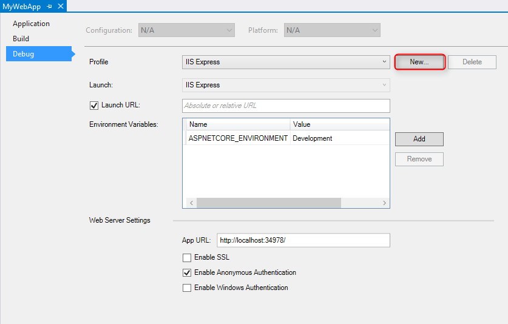

    _Create a new launch profile_

1. Name the new launch profile **IIS Express (Staging)**

1. In the **Launch** dropdown chose **IIS Express**

    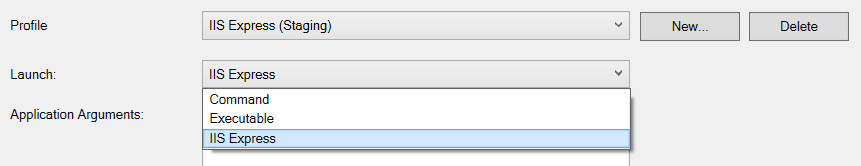

    _Launch IIS Express_

1. Add an **Environment Variable** named `Hosting:Environment` with a value of `Staging` and save the changes to your project properties.

    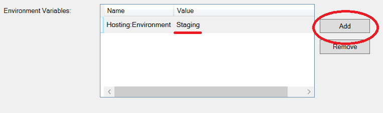

    _Set Environment Variable_

1. In the **Debug** Dropdown, select **IIS Express (Staging)** and launch your application. You should now see the environment name displayed in the footer of your web application.

<a name="Exercise3"></a>
### Exercise 3: Working with Multiple Deployment Slots ###

**Azure App Service Web Apps** enables you to perform staged publishing. When you deploy your site, you can choose to deploy it to a separate deployment slot instead of the default production slot. And then swap the deployments in these two slots with no down time. This is really useful for validating changes before releasing to the public, incrementally integrating site content, and rolling back if changes are not working as expected.

In this exercise, you'll deploy an application to the staging environment of your **Azure App Service Web Apps**. To do this, you'll create the Web App and provision the required components at the management portal, download a publish profile, and deploy from Visual Studio. You will then execute the application in this staging environment to verify its operation. Once you're satisfied that it's working according to your expectations, you'll promote the application to production.

> **Note:** To enable staged publishing, the Web App must be on one of the Standard plans. Note that additional charges will be incurred if you upgrade your Web App to a Standard plan. For more information about pricing, see [App Service Pricing](http://azure.microsoft.com/en-us/pricing/details/app-service/).

<a name="Ex3Task1"></a>
#### Task 1 - Scaling up your Azure Web App ####

1. Go to the [Azure Portal](https://portal.azure.com) and sign in using the Microsoft account associated with your subscription.

1. Select **App Services** from the nav bar on portal.azure.com and select your previously created Web App.

    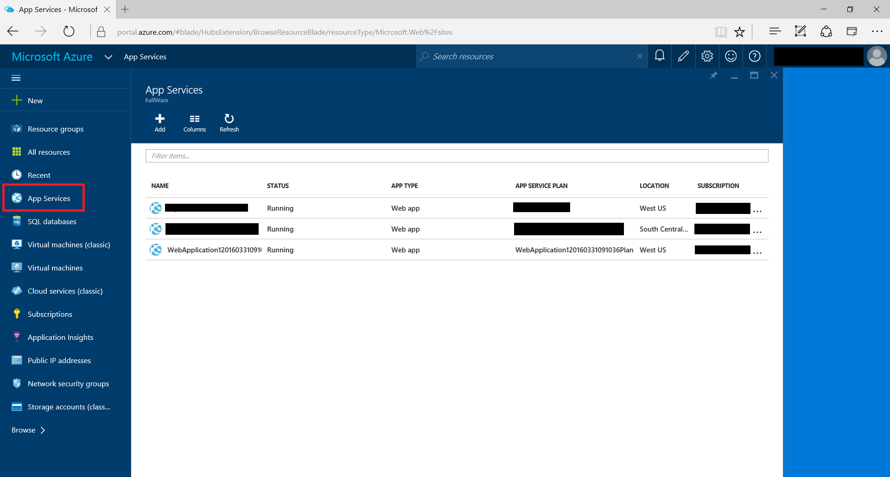

    _Select App Service in Portal_

1. Select **Scale Up (App Service Plan)** in the **Settings** blade of your web app. If your Web App is not on a **Standard** plan, select one by clicking the **Pricing tier** tile. For instance, select the **S1 Standard** plan.

    

    _Web App Pricing tier_

    > Microsoft Azure offers 5 plans for users to run their Web Apps - Free, Shared, Basic, Standard and Premium. In Free and Shared, all Web Apps run in a multi-tenant environment and have quotas for CPU, Memory, and Network usage. You can mix and match which sites are Free (strict quotas) vs. Shared (more flexible quotas). The maximum number of free Web Apps may vary with your plan. In Standard, you choose which Web Apps run on dedicated virtual machines that correspond to the standard Azure compute resources. You can change the mode of your Web App by clicking the **Pricing tier** tile in the **Usage** section of the corresponding App Service plan blade.

1. Back in the **Settings** blade, select **Deployment slots**. Click the **Add Slot** command at the top and create a new slot named **staging**. Set your Web App as **Configuration Source** and then click **OK**.

    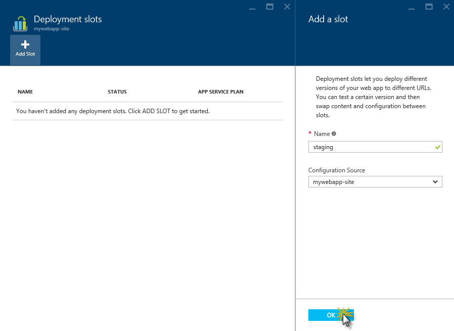

    _Creating the staging deployment slot_

1. After a few seconds you'll see a new slot with the name of your Web App followed by _**-staging**_. Select it to navigate to the *staging Web App* settings.

1. Select **Application Settings** in the **Settings** blade and add an **App Setting** named `Hosting:Environment` with a value of `Staging`

    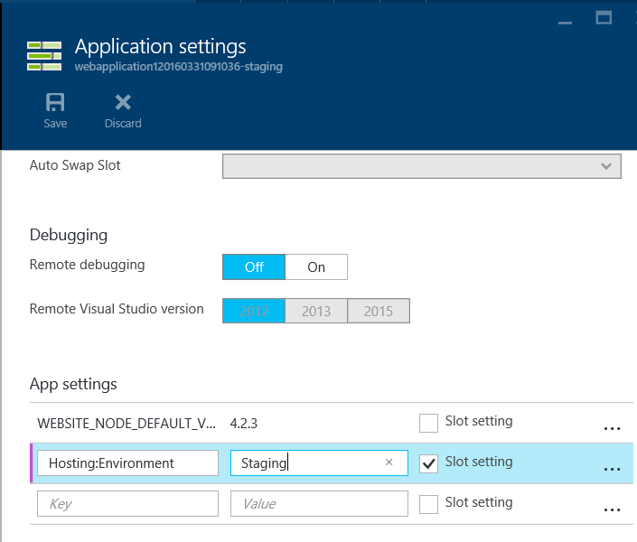

    _Setting Staging Environment Variable_

1. Download the **Publish Profile** for the staging slot from the Web app blade.

    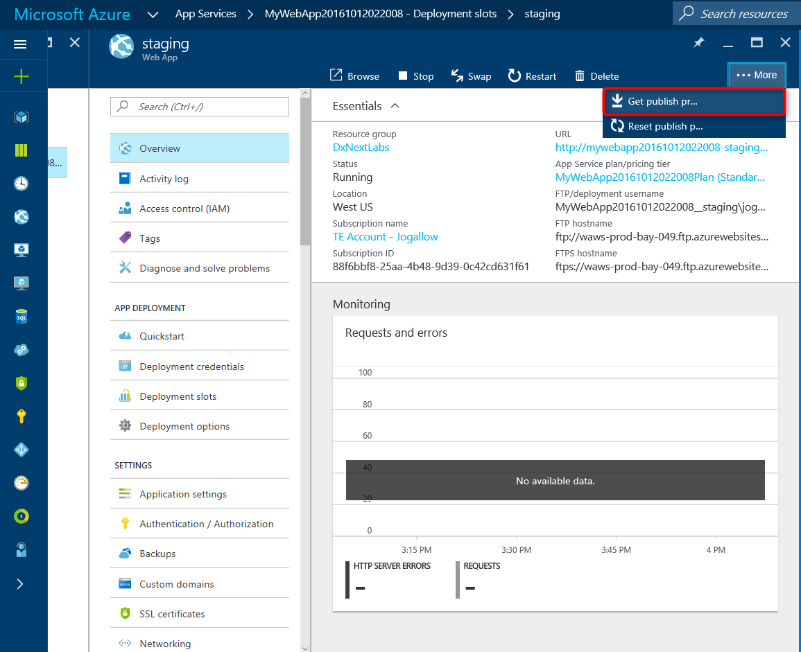

    _Download publish profile_

1. In Visual Studio, right-click on the Project in **Solution Explorer** and select **Publish...**.

1. In the **Publish Web** dialog, click the **Profile** tab and choose **Import**.

    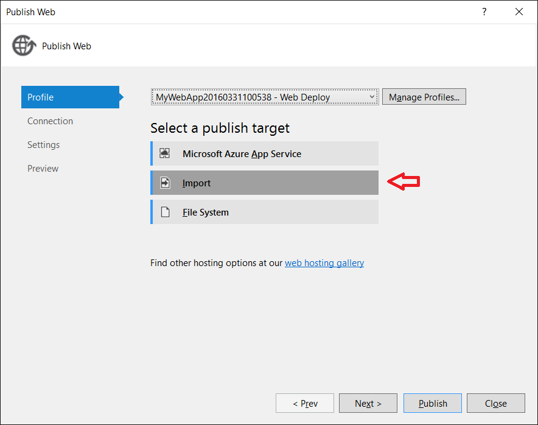

    _Import Publish Settings_

1. Import the downloaded **Publish Profile**

    > **Note**: Ensure you have downloaded the profile for your staging slot. The filename should end with *..(staging).publishsettings*

    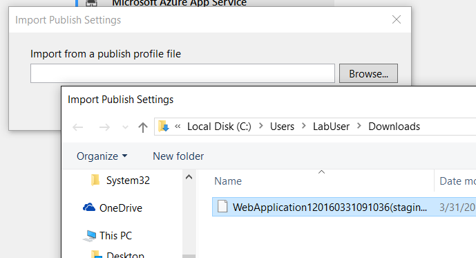

    _Select Publish Settings_

1. In the **Preview** tab on the **Publish Web** dialog, ensure you have selected the Web Deploy publish profile for your staging slot and then click Publish.

<a name="Ex3Task2"></a>
#### Task 2 - Publish a change to the staging slot ####

1. In Visual Studio, use the **Solution Explorer** to open the `Views\Shared\_Layout.cshtml` file.

1. Change the content of the **About** link to **About Us** 

    ```html
    <li><a asp-controller="Home" asp-action="About">About</a></li>
    ```

1. Right-click the **MyWebApp** project and select **Publish...**. In the **Publish Web** dialog, select your staging slot and click Publish.

    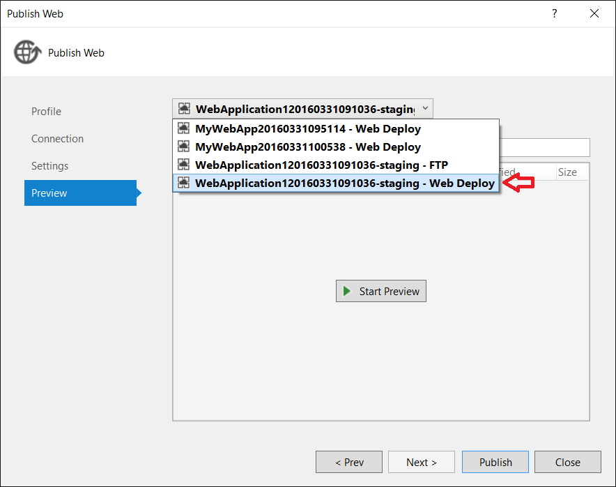

    _Publish to Staging_

<a name="Ex3Task3"></a>
#### Task 3 - Promote your staging slot to production ####

1. Go back to the Azure Portal and navigate to the *staging Web App*.

1. Click the **Swap** command at the top.

    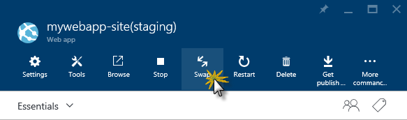

    _Swap to production_

1. Verify that the **Source** targets the staging slot and the **Destination** targets production, and then click **OK** to proceed with the swap operation. Azure will immediately swap the content of the production site with the content of the staging site.

    > **Note:** Some settings from the staged version will automatically be copied to the production version (e.g. connection string overrides, handler mappings, etc.) but others will stay the same (e.g. DNS endpoints, SSL bindings, etc.).

    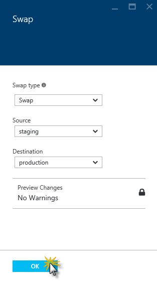

    _Confirming swap operation_

1. Once the swap is complete, browse to your Web App in both slots. You can verify that the production site is now the one with the deployed application.

    > **Note:** You might need to refresh your browser to clear the cache. In Microsoft Edge, you can do this by pressing **CTRL+F5**.

    

    _Web App running in the production environment_

---

<a name="Summary" ></a>
## Summary ##

By completing this module, you should have:

- Created and deployed a Web Application to a Microsoft Azure Web App using Visual Studio
- Changed behavior of your app based on different deployment environments
- Worked with Multiple Deployments Slots in Azure

> **Note:** You can take advantage of the [Visual Studio Dev Essentials](https://www.visualstudio.com/en-us/products/visual-studio-dev-essentials-vs.aspx) subscription in order to get everything you need to build and deploy your app on any platform.
